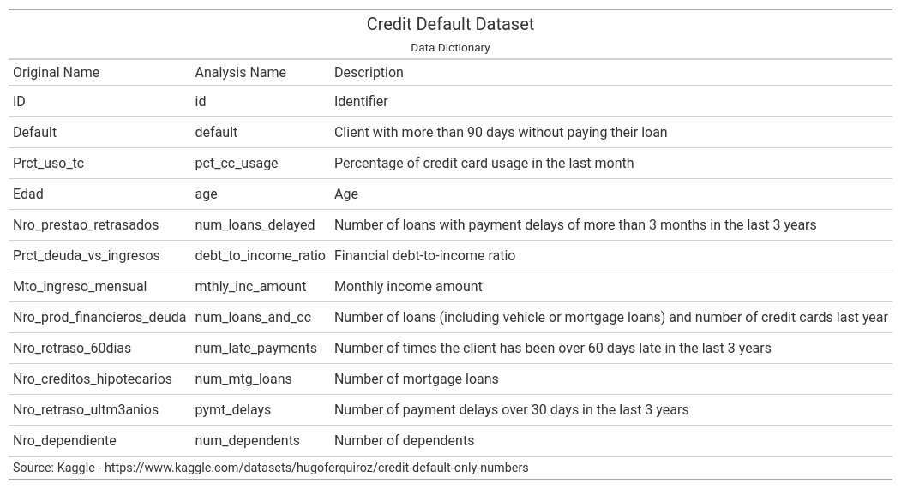
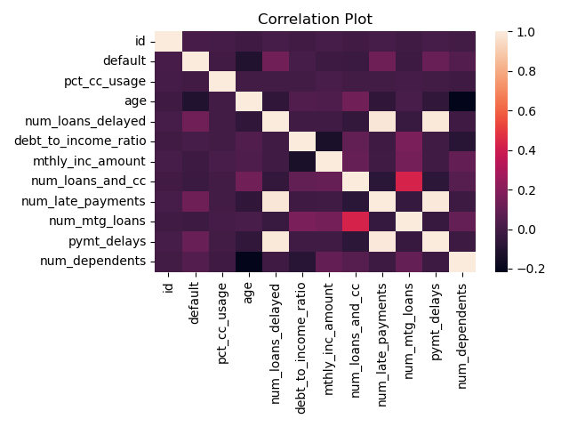
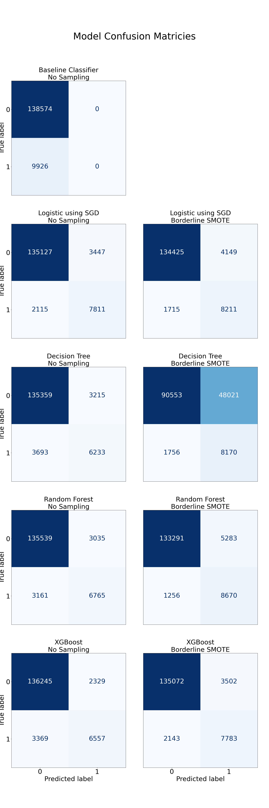
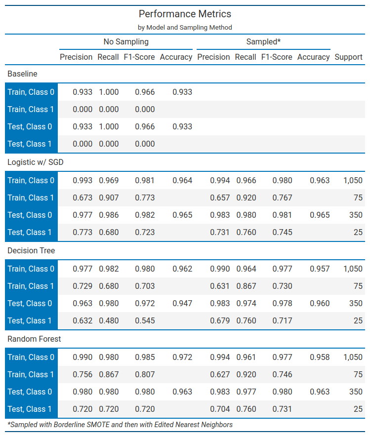

# Capstone Project - Loan Default Final Report

## Problem Statement

A key question for many financial institutions is whether an individual or entity 
will default on a loan. This important question can have wide implications, not 
just for a single institution, but also for economies as a whole.

This project will look at predicting the probability of default using machine 
learning methods.

## Model Outcomes or Predictions

This is a supervised learning model, binary classication to be more precise. The
output of this project will be several models that yield a prediction of default 
(1 = Default, 0 = No default). Scoring techniques will be used to choose the best
model for our purposes.

## Data Aquisition

This analysis is based on a dataset from Kaggle[[1]](#1). It is titled
'credit default only numeric data', and is provided by Hugo Fernandez Quiroz. The
columns of the raw dataset are detailed below. Note that columns have been renamed,
as original column names were in Portugues.

These columns represent a number of financial indicators that could be drivers
of default rates. Note that the default rate of the overall data is approximately
6.7%. Consequently, this represents an unbalanced classificaton.

The data has been anonymized by the original author, so any Personal 
Identifiable Information has been eliminated.

  

The correlation plot shows mixed results. This could be indicatative of no relationship, however it could also suggest that the relationships are non-linear
in nature.

## Data Preprocessing/Preparation

There were a number of data preproccessing steps that were undertaken.

1) **Treat Missing Values** - Two columns, mthly_inc_amount, and num_dependents had
   20.3% and 2.5% missing values respectively. In order to perserve these columns
   in the modeling, K-Nearest Neighbors was used to impute values.
2) **Duplicate Values** - After exploratory analysis, no duplicate values were found.
3) **Outliers** - Outliers were found to be a problem across many variables. We used
   the Isolation Forest Algorithm (based on Random Forest) to flag and eliminate
   outliers.
4) **Training/Test Splits** - The training/split was executed using the scikit
   defaults, which are 75% and 25% for train and test sets respectively.
5) **Sampling** - The classification problem was found to be imbalanced.  
   Consequently, we used the BorderlineSMOTE algorithm, found in the imblearn module, to create balanced versions of the training datasets.
6) **Feature Engineering** - For the Stochastic Gradienct Descent Logistic 
   Regression model, polynomial features were generated. 
6) **Encoding** - For certain models (ie. Logistic Regression) a standard scaling was
   used on all features. This aided in the convergence of the algorithm. 

## Modeling

Four different models were evaluated for this investigation. Details are given below.

1) **Baseline (Dummy) Classifer** - This was a model that always predicted the 
   majority class (no default). This model is the baseline against which other models
   are judged. This baseline model had no sampling or feature engineering.
2) **Logistic Classification using Stochastic Gradeint Descent** - Polynomial features 
   were generated. All features were then standardized for better convergence. Stochastic gradient desecent was used for computational efficiency. Sequential feature selection was then performed. Stochastic gradient descent was then used
   to fit the Logistic Classification
3) **Decision Tree** - A decision tree was generated using grid search over
   hyperparameters. The final decision tree was the result of a grid search over 
   the following hyper parameters:

   - Minimum Impurity Decrease (range from .001 to .05)
   - Max Tree Depth (2, 5, or 10)
   - Minimum Samples Split (0.1, 0.2, 0.5)
   - Criterian (gini or entropy)

4) **Random Forest** - A random forest model was generated. The algorithm used 
   the default settings.

All but the baseline model were also run against the unsampled dataset and a dataset
sampled using the borderline Synthetic Minority Over-Sampling Technique (SMOTE)[[2]](#2), implemented in imblearn library[[3]](#3). This particular version of SMOTE focuses on generating more observations in the area of overlap between classes.

## Model Evalution

Modeling results from the four different models investigated were remarkably similar
with only small differences in the confusion matricies. See the results in the below
graphic.

The following table takes a look at some of the key performance metrics across
the different models.

  

## Results & Findings

After fitting all models, there was very little evidence of overfitting. Training 
and Test permformance metrics were very similar across the different models.

Performance across the different models was very close, excluding the baseline
model. Particular attention should be paid to the recall for Class 1, default,
across the models. Recall is a particularly important metric as it is likely more
costly to bear the explict cost of default, which would show on a company balance
sheet.

While marking people as a default risk, and perhaps denying them a loan, has an opportunity cost of lost revenue, it would not show directly on a balance sheet.
Though depending on a companies desire for revenue growth, this could become important.

Interestingly, the recall for Class 1 was approximately the same across all models, 
except the baseline. The absolute level of recall ranged between 0.808 to 0.811.
The decision tree edged out other methods.

The largest area of differentiation across the models was the precision metric
for Class 1, with the Logistic Regression w/ Stochastic Gradient Decent performing
the best.

The conclusion of this project is that a strong model can be built to predict
default of individuals. Under the assumption of greater costs associated with failure
to predict defaults (false positives), we come to the conclusion that the Decision Tree is the best model. However, Logistic Regression with SGD also performed well
with the strongest Class 1 precision.

## Areas for Further Exploration

There are other areas that could further improve model performance. These
improvements would like fall into one of the following categories:

- More sophisticated models: Try additonal modeling techinques (Support Vector
  Machines, etc.)
- Futher tuning on the Random Forest may yeild better results.
- Additional Feature Engineering: Examine other transformations (Box Cox for
  for normality, or perhaps binning certain features)

## Sources

<a id="1">[1]</a> ***Quiroz, H. F. (2024). credit default only numeric data. Kaggle.com. https://www.kaggle.com/datasets/hugoferquiroz/credit-default-only-numbers**

<a id="2">[2]</a> ***H. Han, W. Wen-Yuan, M. Bing-Huan, “Borderline-SMOTE: a new over-sampling method in imbalanced data sets learning,” Advances in intelligent computing, 878-887, 2005.***

<a id="3">[3]</a> ***BorderlineSMOTE — Version 0.14.dev0. (2024). Imbalanced-Learn.org. https://imbalanced-learn.org/dev/references/generated/imblearn.over_sampling.BorderlineSMOTE.html***

‌

