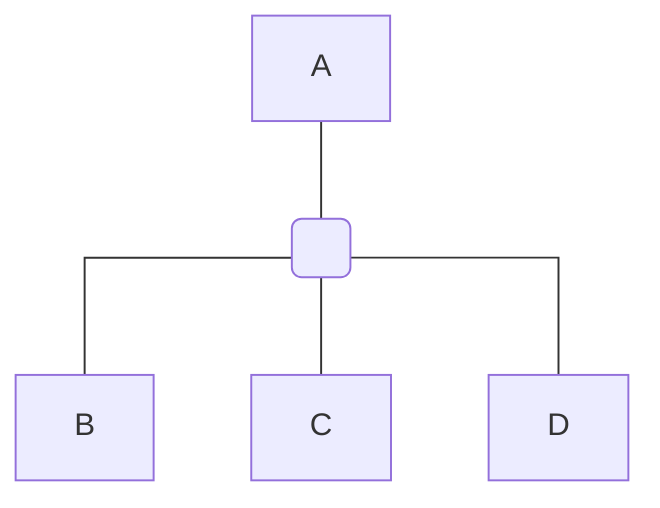

# Predicting Credit Card Default

## Problem Statement

A key question for many financial institutions is whether an individual or entity will default on a loan. This key question can have wide implications, not just for a single institution, but also for economies as a whole.

This project will look at predicting the probability of default using machine learning methods. 

## The Project Structure

## The Data Source

Kaggle Source:

[credit default only numbers](https://www.kaggle.com/datasets/hugoferquiroz/credit-default-only-numbers)
