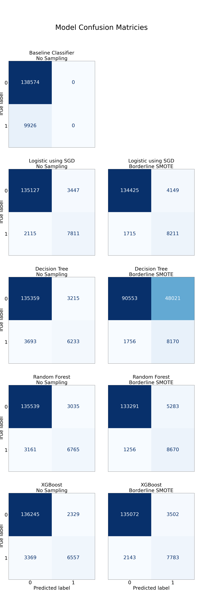

# Capstone Project - Loan Default

- [Capstone Project - Loan Default](#capstone-project---loan-default)
  - [Problem Statement](#problem-statement)
  - [Model Outcomes or Predictions](#model-outcomes-or-predictions)
  - [Data Acquisition](#data-acquisition)
  - [Data Preprocessing/Preparation](#data-preprocessingpreparation)
  - [Modeling](#modeling)
  - [Model Evaluation](#model-evaluation)
  - [Results \& Findings](#results--findings)
  - [Supporting Material](#supporting-material)
    - [Areas for Further Exploration](#areas-for-further-exploration)
    - [The Project Structure](#the-project-structure)
    - [Setting up the environment](#setting-up-the-environment)
    - [Sources](#sources)

## Problem Statement 

A key question for many financial institutions is whether an individual or entity
will default on a loan. This important question can have wide implications, not
just for a single institution, but also for economies as a whole. For individual
lending companies this question has direct impacts on their profits, and thus
the livelihoods of the employees as well.

This project will look at predicting the probability of default using machine
learning methods like Logistic Regression, Decision Trees, Random Forests and
XGBoost. [(toc)](#table-of-contents)

## Model Outcomes or Predictions

This is a supervised learning model, binary classification to be more precise. The
output of this project will be several models that yield a prediction of default
(1 = Default, 0 = No default). Scoring techniques will be used to choose the best
model for our purposes. [(toc)](#table-of-contents)


## Data Acquisition

This analysis is based on a dataset from Kaggle[[1]](#1). It is titled
'credit default only numeric data', and is provided by Hugo Fernandez Quiroz. The
columns of the raw dataset are detailed below. Note that columns have been renamed,
as original column names were in Portuguese. [(toc)](#table-of-contents)


These columns represent a number of financial indicators that could be drivers
of default rates. Note that the default rate of the overall data is approximately
6.7%. Consequently, this represents an unbalanced classification.

The data has been anonymized by the original author, so any Personal
Identifiable Information has been eliminated.

<div align="center">
  
</div>

The correlation plot shows mixed results. This could be indicative of no relationship, however it could also suggest that the relationships are non-linear
in nature.


## Data Preprocessing/Preparation

There were a number of data preprocessing steps that were undertaken.

1) **Treat Missing Values** - Two columns, mthly_inc_amount, and num_dependents had
   20.3% and 2.5% missing values respectively. In order to preserve these columns
   in the modeling, K-Nearest Neighbors was used to impute values.
2) **Duplicate Values** - After exploratory analysis, no duplicate values were found.
3) **Outliers** - Outliers were found to be a problem across many variables. We used
   the Isolation Forest Algorithm (based on Random Forest) to flag and eliminate
   outliers.
4) **Training/Test Splits** - The training/split was executed using the scikit
   defaults, which are 75% and 25% for train and test sets respectively.
5) **Sampling** - The classification problem was found to be imbalanced.
   Consequently, we used the BorderlineSMOTE algorithm, found in the imblearn module, to create balanced versions of the training datasets.
6) **Feature Engineering** - For the Stochastic Gradient Descent Logistic
   Regression model, polynomial features were generated.
7) **Encoding** - For certain models (ie. Logistic Regression) a standard scaling was
   used on all features. This aided in the convergence of the algorithm. [(toc)](#table-of-contents)

## Modeling

Four different models were evaluated for this investigation. Details are given below.

1) **Baseline (Dummy) Classifier** - This was a model that always predicted the
   majority class (no default). This model is the baseline against which other models
   are judged. This baseline model had no sampling or feature engineering.
2) **Logistic Classification using Stochastic Gradient Descent** - Polynomial features
   were generated. All features were then standardized for better convergence. Stochastic gradient descent was used for computational efficiency. Sequential feature selection was then performed. Stochastic gradient descent was then used
   to fit the Logistic Classification
3) **Decision Tree** - A decision tree was generated using grid search over
   hyperparameters. The final decision tree was the result of a grid search over
   the following hyper parameters:

   - Minimum Impurity Decrease (range from .001 to .05)
   - Max Tree Depth (2, 5, or 10)
   - Minimum Samples Split (0.1, 0.2, 0.5)
   - Criterion (gini or entropy)

4) **Random Forest** - A random forest model was generated. The algorithm used
   the default settings.

All but the baseline model were also run against the unsampled dataset and a dataset
sampled using the borderline Synthetic Minority Over-Sampling Technique (SMOTE)[[2]](#2), implemented in imblearn library[[3]](#3). This particular version of SMOTE focuses on generating more observations in the area of overlap between classes. [(toc)](#table-of-contents)

## Model Evaluation

Modeling results from the four different models investigated were remarkably similar
with only small differences in the confusion matrices. See the results in the below
graphic.



The following table takes a look at some of the key performance metrics across
the different models. [(toc)](#table-of-contents)

<div align="center">
  
</div>

## Results & Findings

After fitting all models, there was very little evidence of overfitting, looking at
the accuracy measures. Some deviation between the training and testing sets was
evident in the precision and recall of the sampled models. Test performance metrics
were very similar across the different models.

Particular attention should be paid to the recall for Class 1, default,
across the models. Recall is a particularly important metric as it is likely more
costly to bear the explicit cost of default, which would show on a company balance
sheet.

While marking people as a default risk, and perhaps denying them a loan, has an opportunity
cost of lost revenue, it would not show directly on a balance sheet.
Though depending on a companies desire for revenue growth, this could become important.

The recall varied quite a bit for the non sampled models. Results for recall on class
1 was more consistent with the sampled models, but still slight variation was seen.
The sampled random forest did the best on the test set class 1 recall metric, with
a reading of 0.822. This would likely be the best recommendation if emphasis is to
avoid miss labeling those that would default. Note that the increased recall for
this model came at a price of decreased precision. If an leadership team wanted to strike
a better balance for these metrics, the Logistic Classification with Sampling might
be a good choice.

The conclusion of this project is that a strong model can be built to predict
default of individuals. Under the assumption of greater costs associated with failure
to predict defaults (false negatives), we come to the conclusion that the Random forest
with sampling is the best model. However, Logistic Regression with SGD and sampling also
performed well. [(toc)](#table-of-contents)

## Supporting Material

### Areas for Further Exploration

There are other areas that could further improve model performance. These
improvements would like fall into one of the following categories:

- More sophisticated models: Try additional modeling techniques (Support Vector
  Machines, etc.)
- Further tuning on the Random Forest may yield better results.
- Additional Feature Engineering: Examine other transformations (Box Cox for
  for normality, or perhaps binning certain features)

### The Project Structure

```
Root┐
    ├ README.md
    ├ loan_default_tech_report.ipynb
    ├ Loan Default Final Report.md
    ├ environment.yml
    ├ /data
    ├ /models
    └ /assets
```

- README.md: This document
- loan_default_tech_report.ipynb: Ipython notebook containing the technical analysis and modeling.
  Represents the technical report.
- Loan Default Final Report.md: The final business report of results for the loan default
  prediction modeling.
- environment.yml: conda environment file to build the environment for this project.
- /data: directory of all related data.
- /models: directory of serialized pickel files containing classifiers, pipelines, etc.
- /assets: directory of all related assets for report generation.

### Setting up the environment

You must have conda or similar package manager installed. Running the notebook 
also requires that you have chrome installed on your system. The environment
can be setup using the following command executed from where you have cloned
this directory.

```sh
conda env create -f environment.yml
```

### Sources

<a id="1">[1]</a> ***Quiroz, H. F. (2024). credit default only numeric data. Kaggle.com. https://www.kaggle.com/datasets/hugoferquiroz/credit-default-only-numbers**

<a id="2">[2]</a> ***H. Han, W. Wen-Yuan, M. Bing-Huan, “Borderline-SMOTE: a new over-sampling method in imbalanced data sets learning,” Advances in intelligent computing, 878-887, 2005.***

<a id="3">[3]</a> ***BorderlineSMOTE — Version 0.14.dev0. (2024). Imbalanced-Learn.org. https://imbalanced-learn.org/dev/references/generated/imblearn.over_sampling.BorderlineSMOTE.html***

 [(toc)](#table-of-contents)
